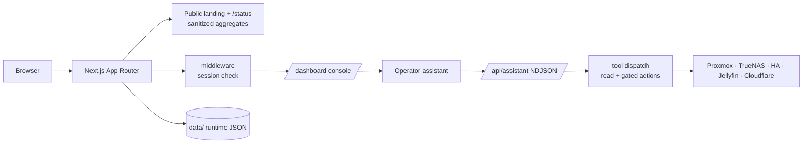

# SignalDeck — homelab dashboard + operator assistant

A self-hosted dashboard for a personal homelab. It serves two surfaces from one
Next.js app: a **public landing + status page** (sanitized, read-only) and an
**authenticated operator console** that reads and *acts on* the real backends
(Proxmox VE, TrueNAS SCALE, Home Assistant, Jellyfin, Cloudflare) — driven either
by hand or by an integrated AI **operator assistant** that can manage and set up
the lab for you.

> Next.js 16 (App Router, Turbopack) · React 19 · TypeScript · CSS Modules ·
> OKLCH dual theme. Runtime state is plain JSON under a gitignored `data/`.

---

## Two surfaces, one app

- **Public front door** — landing page + `/status` history. Serves only
  AGGREGATES: counts, coarse health levels, a handful of deliberately-public
  traffic hostnames. No IPs, paths, tokens, VM names, or topology ever cross the
  unauthenticated boundary.
- **Operator console** (`/dashboard`) — live panels for compute, storage, media,
  automation, and traffic, plus the assistant sidebar. Everything richer than the
  public aggregates sits behind a session check.



---

## Network-safety model

The console holds real, write-capable credentials and is internet-reachable, so
the security model is layered and deliberate. **No VPN is required**; the layers
below stand on their own.

### 1. Secrets never leave the server
Credentials live only in `.env.local` (gitignored) or the runtime override store
(`data/`, gitignored), and are read only in server-only modules. Client
components receive booleans at most (e.g. "2FA is enabled"). Secret *values* are
never logged, printed, or echoed — key names only. The only path that returns a
secret to the browser is a re-auth-gated reveal route (fresh password + TOTP).

### 2. Sanitized public routes
`/api/status`, `/api/traffic`, `/api/history` return non-identifying aggregates
only. Anything richer requires a session.

### 3. Sessions
Token = HMAC-SHA256 over `g.<epoch>.<issuedAt>`; `httpOnly`, `sameSite=lax`,
`secure` in production, 7-day max age. An embedded epoch is checked on every
verify, so "sign out everywhere" invalidates all sessions at once. Login itself
is throttle-first (per-IP exponential backoff + global breaker), constant-time
password compare, single-use replay-guarded TOTP, and a single generic error
that never reveals which factor was wrong.

### 4. Credential privilege split — dashboard (read) vs agent (write)
Backend tokens come in two tiers, selected **per code path**:

| Path | Tokens | Privilege |
|---|---|---|
| Read/display (snapshot, public aggregates, panels) | `PROXMOX_TOKEN_*`, `TRUENAS_API_KEY`, `HOMEASSISTANT_TOKEN` | least-privilege / read-only |
| Agent actions (`lab_request`, `guest_power`, `ha_service`, `run_shell`) | `*_AGENT` variants via `cfgAgent()` (fall back to the base key) | write-capable |

A bug in the internet-adjacent read path therefore can't reach the write token.
Both tiers can share the same gitignored file — the separation that matters is
which code holds which.

### 5. Keep the write token usable only from the LAN
- **Firewall the backend API ports** (e.g. Proxmox `8006`, TrueNAS `443`) to the
  dashboard's host + your admin machines. A leaked token then does nothing from
  off-LAN. Highest-leverage control.
- The dashboard reaches backends by **internal IP** (`*_HOST` = LAN IP,
  `*_VERIFY_TLS=false` for self-signed). Public admin hostnames can stay behind
  Cloudflare Access and need not be reachable by the dashboard at all.

### 6. Destructive-action re-auth gate (blacklist + 30-min elevation)
A small blacklist of the most irreversible shapes — `destroy / delete / wipe /
mkfs / wipefs / rm -rf`, matched on the action detail — **always** requires a
fresh re-auth (password + TOTP) before running, regardless of the approval mode
(a hard floor even in autonomous mode). A success opens a **~30-minute elevation
window** during which further destructive actions run without re-prompting — so
destroying two containers is one TOTP, not two. The credentials are verified
server-side (`reverifyCredentials` → `grantElevation`) before the paused turn
resumes; everything *not* on the blacklist keeps its normal behavior.

### 7. Headers & transport
`frame-ancestors 'none'`, `X-Frame-Options`, `nosniff`, `Referrer-Policy`,
`Permissions-Policy`, HSTS on every route. TLS verification to backends defaults
ON; `*_VERIFY_TLS=false` is a per-host, owner-set exception for self-signed labs.

---

## Operator assistant — how it works

The assistant is a streaming, tool-using co-pilot that holds the write
credentials and can do anything the configured tokens permit. The guard rail is
the **operator's approval**, not a narrow tool menu.

### Hands (tools)
- **`lab_request(service, method, path, body)`** — one generic tool reaching the
  full REST/JSON-RPC surface of every backend; the server resolves each to its
  own base URL + auth + transport. `guest_power` and `ha_service` are convenience
  wrappers; `run_shell` runs commands over SSH (e.g. `pct exec`) for what no API
  covers; `list_ha_entities` / `read_reference` round it out.
- **The model never sees the backend secret.** It supplies only
  `service / method / path / body` — never a credential. The server attaches the
  token to the outgoing request itself, so the API secret is in neither the
  tool's input nor its result (which is just the response data + status). The
  executable closure for any action **never leaves the server**.

### Modes & approval
- **Ask** — advise and *propose*; calling an action registers a one-click
  confirmation card that runs later, nothing executes now.
- **Agent** — execute inline, with an approval level:
  - `all` — confirm every action;
  - `critical` — auto-run safe/reversible actions, confirm destructive ones;
  - `auto` — fully autonomous (no second gate).
- Confirmation pauses the open NDJSON stream and resumes when the operator posts
  a decision — so the agent keeps going on its own, pausing only as long as a
  yes/no takes.

### Risk classification
Actions are risk-classified server-side. In `critical` mode, **read-only shell
commands and GET-style calls auto-run** (so `critical` isn't just "confirm
everything"); only commands that delete/overwrite files or stop/destroy/
reconfigure a service or guest pause for a click. On top of that, the
destructive blacklist (§6 above) demands a fresh re-auth.

### Knowledge tiers
The assistant keeps lab knowledge where it stays correct:
1. **Hardcoded** — only generic capability knowledge (that the backends exist and
   the *shape* of their APIs), pulled on demand via `read_reference`.
2. **Core prompt** — a lean, stable instruction set, structured for provider
   prompt-caching.
3. **Global memory** — durable, lab-specific facts (topology map, quirks,
   discovered entity ids), operator-visible and editable; the model builds and
   refreshes it from `/cluster/resources`.
4. **Per-chat workspace** — one-off intent for the current conversation:
   `note_to_self` for chat-only facts, and `plan_set`/`plan_update` for a
   checklist the model builds for *long* multi-step tasks. Shown to the operator
   as a pinned card and never written to global memory.

### Other features
- **Skills** — client-side slash commands. `/compact [%]` rewrites the transcript
  into a tight brief to shrink context (`/compact 10` → ~10%).
- **ETA timers** — when a step needs to wait, the model sets a live countdown;
  the composer locks while it runs, you can interject (keep the timer and talk)
  or delete it, and on elapse the agent auto-resumes.
- **Context wheel** — a usage pill by the model chip; hover shows the estimated
  share of the model's window in use.
- **Providers** — Anthropic, Gemini, and OpenAI-compatible (OpenAI / DeepSeek /
  GLM). Model keys are server-only and write-only; the client learns at most
  which provider is configured.
- **Shared chat history** — transcripts are centralized server-side so the same
  chats appear across every browser/device (single-user gate).

---

## Development

```bash
npm run dev      # Turbopack dev server (LAN-exposed)
npm run build    # production build (output: 'standalone')
npm run start    # run the production server
npx tsc --noEmit # type-check (run before shipping)
```

### Layout
- `app/` — routes, pages, API handlers (`app/api/...`).
- `components/` — UI, console panels, the assistant sidebar.
- `lib/` — server-side logic: backend wrappers (`console.ts`, `homelab.ts`),
  assistant (`lib/assistant/*`), auth/session, config.
- `data/` — uncommitted runtime JSON (chats, memory, workspace, history, auth).

## Deployment

Containerized (multi-stage Node 22 `standalone` build) and deployed via a
git-push PaaS; see `DEPLOY-COOLIFY.md`. Configure keys in the platform's env (see
`.env.example`), keep `data/` on a persistent volume, and serve only through a
reverse proxy with TLS. Never commit `.env.local` or `data/`.
