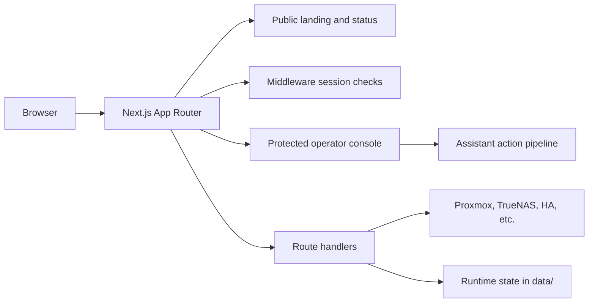

# Homelab Dashboard

A Next.js dashboard for monitoring and managing a personal homelab. It provides a clean, read-only public landing page for high-level status, and a secure, authenticated operator console for direct backend control.

## Overview

This dashboard serves two distinct surfaces from a single application:
- **Public Front Door:** A landing page and status history view displaying sanitized, aggregated health metrics.
- **Operator Console:** An authenticated dashboard that aggregates data from Proxmox, TrueNAS SCALE, Home Assistant, and Jellyfin. It includes an integrated AI assistant for operational tasks.

## Architecture

The core design constraint is strict client/server separation. The browser receives only the minimal data required to render the UI.

- **Server-Side Secrets:** API keys and credentials live exclusively in `.env.local` and are accessed only by server components and route handlers.
- **Sanitized Public Routes:** Unauthenticated routes expose only aggregated status counts. Internal IPs, node names, and topologies are never leaked.
- **Secure Sessions:** The operator console is guarded by Next.js middleware using HMAC-SHA256 signed tokens with epoch-based revocation.
- **State Management:** Mutable application state (auth sessions, chat history, metrics logs) lives in plain JSON files within the git-ignored `data/` directory. The server is the absolute source of truth.

## Operator Assistant

The console includes an AI assistant designed for safe, controlled homelab management.
- **Read-Only Streaming:** Answers questions and pulls live snapshots from server-side helpers.
- **Gated Execution:** Actions are classified by risk. Depending on the mode, sensitive actions pause the stream and require explicit operator confirmation before executing.
- **Controlled Tools:** The assistant communicates with backends via a generic `lab_request` tool. The execution logic never leaves the server.

## Development

- `npm run dev` — start the Turbopack development server.
- `npm run build` — create a production build.
- `npm run start` — run the production server.

### Repository Layout

- `app/` — routes, pages, and API handlers.
- `components/` — UI elements and console panels.
- `lib/` — server-side business logic, backend API wrappers, and assistant tools.
- `data/` — uncommitted runtime JSON state.

## Deployment

- Configure all required keys in `.env.local` (refer to `.env.example`).
- Do not commit the `data/` directory or `.env.local`.
- Use a reverse proxy with TLS for production traffic.
