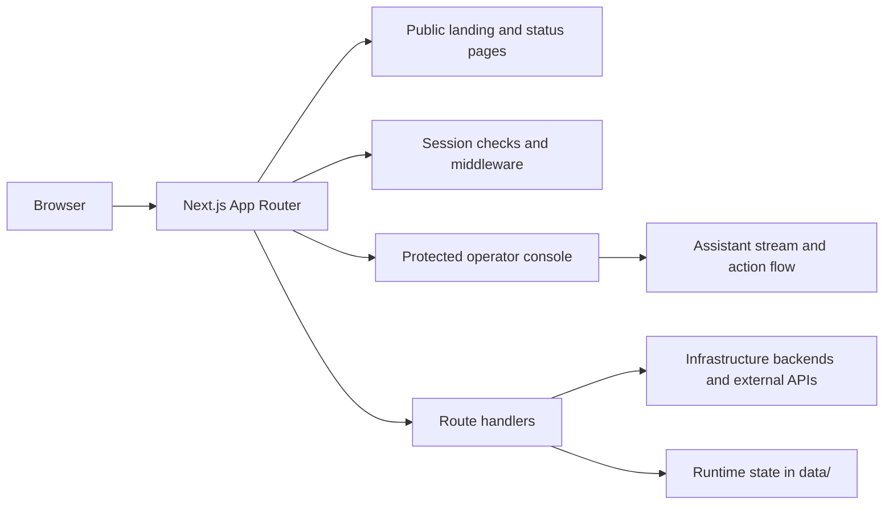

# Self-hosted dashboard and operator console

This repository contains a self-hosted web tool for monitoring infrastructure, viewing service history, and interacting with backend systems through a controlled operator console.

It is built as a single Next.js application that serves two distinct surfaces:

- A public landing page that shows a concise status snapshot and routes signed-in users to the console.
- A protected operator console for deeper inspection, assistant-driven workflows, and privileged actions.

## Architecture

The project is organized around server-side data access. Secrets and backend credentials stay on the server, while the browser only receives the data needed to render the current view.

Key implementation choices:

- Next.js App Router with server components and route handlers for all backend access.
- Middleware protection for privileged console routes.
- CSS Modules for component-scoped styling.
- A small, explicit server/client split: client components handle interaction, server modules handle credentials and state.

## Main surfaces

- Public landing page: a branded front door with current status cues, service metrics, and entry points.
- Status/history page: recorded service health over time, backed by persisted history data.
- Operator console: authenticated view for system state, assistant interactions, settings, and privileged actions.
- Assistant sidebar: chat, model selection, memory notes, and controlled action execution.

## Assistant and control flow

The assistant is designed to be useful without becoming unconstrained.

- Read-only questions stream responses from the model and can pull live snapshots from server-side helpers.
- Action requests are either proposed for later confirmation or executed inline depending on mode and approval level.
- Sensitive writes require explicit confirmation or re-authentication, depending on the operation.
- Provider keys are write-only through the UI and are never echoed back to the browser except through dedicated reveal flows.

## Data and state

Persistent runtime data lives outside the source tree and is treated as application state, not code:

- `.env.local` holds secrets and service credentials.
- `data/` holds runtime JSON state such as auth, assistant memory, chats, and history.
- The browser may cache some UI state locally, but the server copy is the source of truth for shared operator data.

## Security model

The application is built around a few hard rules:

- Secrets never leave server-only modules.
- Public routes expose only sanitized aggregates.
- Sessions are signed, revocable, and time-limited.
- Privileged routes are always gated.
- Sensitive operations should be confirm-gated and should fail safely if the backend token does not have the required scope.

## Development

Common scripts:

- `npm run dev` — start the development server.
- `npm run build` — create a production build.
- `npm run start` — run the production server.
- `npm run lint` — run linting.

## Repository layout

- `app/` — routes, pages, and route handlers.
- `components/` — reusable UI pieces and console panels.
- `lib/` — server-side logic, API wrappers, auth, assistant tools, and shared helpers.
- `data/` — runtime JSON state.
- `middleware.ts` — route protection for privileged areas.

## Notes for deployment

- Keep secrets in `.env.local` and do not commit runtime state.
- Ensure the deployment environment has the backend credentials required for the pages and the assistant to function.
- Use a reverse proxy or tunnel with TLS for production.